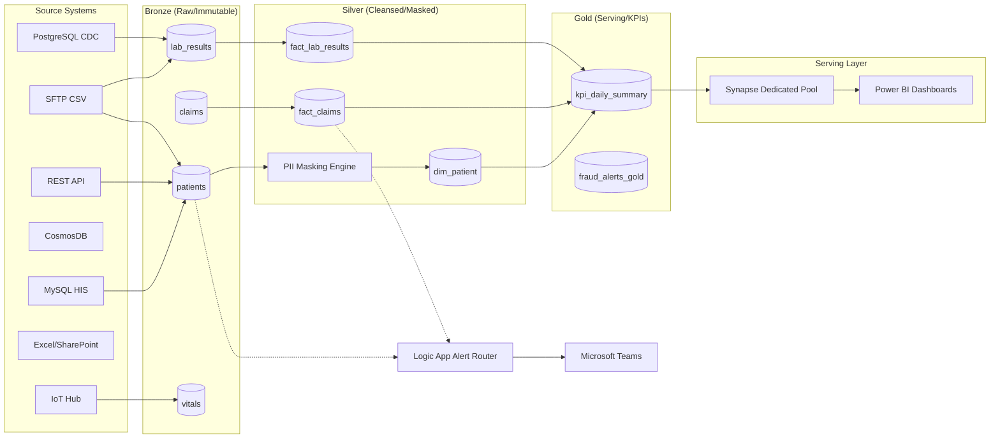

# Enterprise Data Lineage Graph
## MediFlow360 Unified Patient Intelligence

This document visualizes the end-to-end data flow and transformations.

### Transformation Logic Key
- **Bronze → Silver**: Schema enforcement, PII masking (Hashing/Regex), SCD Type 2 application.
* **Silver → Gold**: Business logic application, Cross-entity joins, Aggregations.
* **Gold → Synapse**: PolyBase loading, Hash-distribution for performance.
